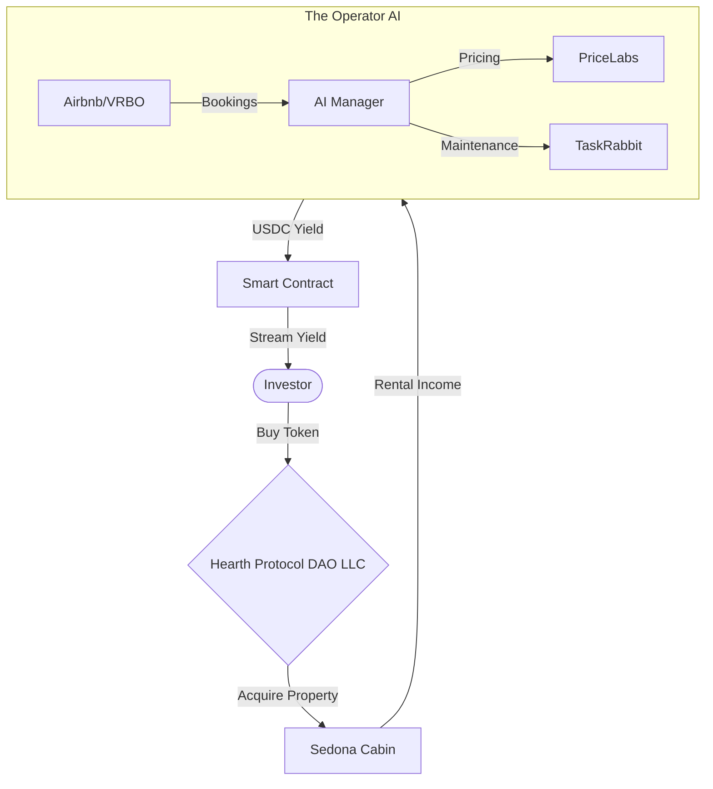

# Hearth DAO: The Autonomous Cycle

## Frontend Tech Stack

**Decision (2026-02-14):** Next.js + RainbowKit + Wagmi

| Priority | Feature | Stack |
|---|---|---|
| P0 | Crowdsale UI | Next.js, RainbowKit, Wagmi |
| P1 | Governance UI | Next.js, RainbowKit, Wagmi |

RainbowKit handles wallet connection UX. Wagmi handles contract reads/writes. Next.js for routing and SSR.
