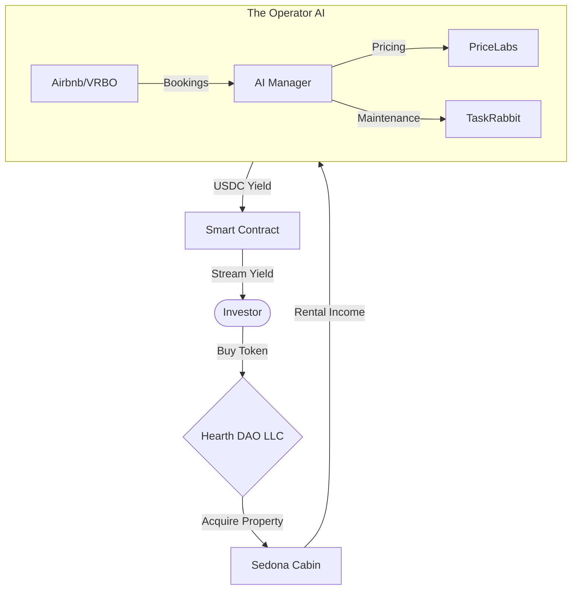

# Hearth Protocol: The Autonomous Cycle

```mermaid
graph TD
    User([Investor]) -->|Buy Token| DAO{Hearth DAO LLC}
    DAO -->|Acquire Property| Property[Sedona Cabin]
    
    subgraph Ops [The Operator AI]
        API[Airbnb/VRBO] -->|Bookings| Agent[AI Manager]
        Agent -->|Pricing| Dynamic[PriceLabs]
        Agent -->|Maintenance| Vendor[TaskRabbit]
    end
    
    Property -->|Rental Income| Ops
    Ops -->|USDC Yield| Contract[Smart Contract]
    Contract -->|Stream Yield| User
```
